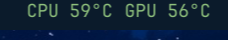
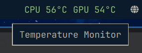
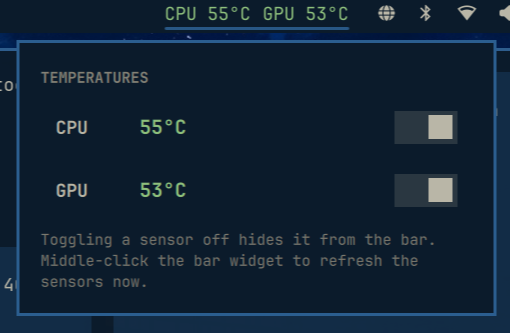

# Temperature Monitor

A tiny [Omarchy](https://omarchy.org) bar widget that shows your **CPU and GPU
temperatures**, colour-coded by threshold: green while things are normal, orange
once you cross the warn line, and red when it's genuinely hot.

```
CPU 57°  GPU 49°
```

Both readings are plain text on the bar, each coloured independently, so a busy
CPU and an idle GPU read differently at a glance.

**Click the widget** to open a popup with the same readings in the same colours,
plus a switch for each sensor to hide (or bring back) it on the bar. That's
built for machines without a discrete GPU — if you only have an integrated one
(which may expose no temperature sensor at all), turn the GPU readout off and
it stops cluttering the bar. The switches persist across restarts.

## Screenshots

| The widget in the bar | Hovering shows the name | The popup with per-sensor toggles |
| :-: | :-: | :-: |
|  |  |  |

## Install

```
omarchy plugin add https://github.com/Ranger2-02/omarchy-temperature-monitor.git --enable
```

The widget lands in the **right** section by default. Move it if you like:

```
omarchy bar move ranger.tempmon --section center
```

Manual install (if you prefer to review the code first — you always should):

```bash
git clone https://github.com/Ranger2-02/omarchy-temperature-monitor.git \
  ~/.config/omarchy/plugins/ranger.tempmon
omarchy-shell shell rescanPlugins
omarchy plugin enable ranger.tempmon --section right
```

There is nothing to build and no dependencies: it's QML plus a small Bash
sensor reader.

## Uninstall

Take the widget off the bar without deleting it:

```
omarchy plugin disable ranger.tempmon
```

Remove it completely:

```
omarchy plugin remove ranger.tempmon
```

## Settings

Open the widget's settings from the Omarchy menu (*Setup > Plugins*), or edit the
entry for `ranger.tempmon` in `~/.config/omarchy/shell.json`:

| Key         | Type    | Default | Description                                          |
| ----------- | ------- | ------- | ---------------------------------------------------- |
| `showCpu`   | boolean | `true`  | Show the CPU temperature.                            |
| `showGpu`   | boolean | `true`  | Show the GPU temperature.                            |
| `showLabel` | boolean | `true`  | Show the `CPU`/`GPU` labels; off gives `57° 49°`.    |
| `unit`      | enum    | `Celsius` | Display unit: `Celsius` or `Fahrenheit`.           |
| `showUnit`  | boolean | `false` | Append the unit letter, e.g. `57°C` / `135°F`.       |
| `warnTemp`  | integer | `75`    | At or above this (°C) the reading turns orange.      |
| `hotTemp`   | integer | `90`    | At or above this (°C) the reading turns red.         |
| `interval`  | integer | `3000`  | Sensor poll interval in milliseconds (min 1000).     |

Example — a compact, less shouty readout that only colours at high heat:

```json
{ "id": "ranger.tempmon", "showLabel": false, "warnTemp": 80, "hotTemp": 95 }
```

## Popup and display toggles

Left-click the widget to open a small popup showing both readings (coloured by
the same thresholds as the bar) and a switch per sensor:

- **CPU** — show/hide the CPU reading on the bar.
- **GPU** — show/hide the GPU reading on the bar.

Turning a sensor off dims its row in the popup and removes it from the bar.
Handy when your machine has no discrete GPU: if the integrated GPU exposes no
sensor, the reading would otherwise sit there as a permanent `--°`.

The switches persist to `showCpu` / `showGpu` in the widget's `shell.json`
entry, so they survive a restart. Middle-click the widget to sample the
sensors immediately. Toggling **both** sensors off removes the widget from the
bar; bring it back from *Setup > Plugins* or by editing `shell.json`.

## How it reads the sensors

`temps.sh` scans the standard sysfs interfaces and never requires root:

- **CPU** — the `x86_pkg_temp` thermal zone, falling back to the hottest
  available thermal zone on machines without a package sensor.
- **GPU** — the first `amdgpu` or `i915` hwmon device exposing `temp1_input`
  (the discrete GPU is preferred when both exist).

Some integrated GPUs expose no temperature sensor at all (for example Intel
`i915` on many laptops publishes no `hwmon` node). When a sensor is missing the
reading shows `--°` rather than guessing — the widget simply reports what the
hardware actually offers.

## Credits

- Built together by **Ranger McTague** and **opencode**.
- Huge thanks to **DHH** for making [Omarchy](https://omarchy.org) — a distro
  where swapping out a piece of your desktop is this pleasant.

## License

[MIT](LICENSE)
